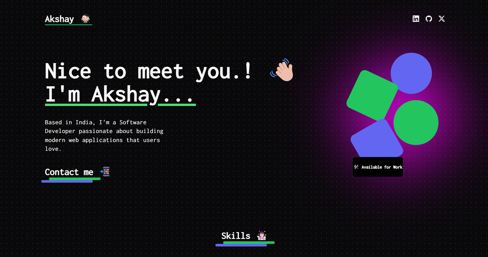

# Personal Portfolio Website
## Project Description
This project is a dynamic and visually stunning personal portfolio website built using Next.js, React, Tailwind CSS, and Framer Motion. The portfolio showcases a curated selection of my projects, providing detailed descriptions, live links, and visual previews to demonstrate my skills and expertise in front-end development.

## Live Site: 
[akshay-u-d.netlify.app](https://akshay-u-d.netlify.app/)

## Screenshot


## Features
> Modern Design: A clean and modern design to make a great first impression.
> Responsive Layout: Fully responsive design ensuring optimal user experience on all devices.
> Interactive Animations: Smooth and engaging animations powered by Framer Motion.
> Project Showcase: Detailed descriptions, live links, and visual previews of selected projects.
> SEO Optimized: Ensures better visibility on search engines.

## Technologies Used
> Next.js: React framework for server-side rendering and static site generation.
> React: JavaScript library for building user interfaces.
> Tailwind CSS: Utility-first CSS framework for styling.
> Framer Motion: Library for creating animations and gestures.

## Getting Started
Prerequisites
Node.js
npm (or yarn)

# Installation
Clone the repository:
```bash
Copy code
git clone https://github.com/akdhiman358/portfolio_nextJs.git
```
Navigate to the project directory:
```bash
Copy code
cd portfolio
```
Install dependencies:
```bash
Copy code
npm install
```
or
```bash
Copy code
yarn install
```
Running the Development Server
```bash
Copy code
npm run dev
```
or

```bash
Copy code
yarn dev
```
Open http://localhost:3000 in your browser to see the result.

Building for Production
```bash
Copy code
npm run build
```
or

```bash
Copy code
yarn build
```
Running in Production Mode
After building the project, you can start it in production mode with:

```bash
Copy code
npm start
```
or

```bash
Copy code
yarn start
```
### Deploying
This project can be deployed to any static site hosting service. Netlify is used for the live version.

### Contributing
If you have suggestions for improvements or encounter any issues, feel free to open an issue or submit a pull request.

### Contact
For any inquiries, please reach out to me via akshayud0@gmail.com
